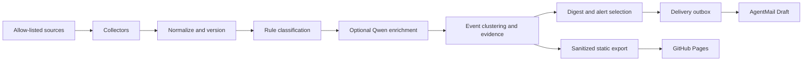

# AI Research Radar architecture

## Runtime boundaries

The system intentionally separates deterministic ingestion from optional AI
enrichment:

1. Collectors fetch only allow-listed sources and preserve source cursors.
2. Normalizers build a stable native identity and content hash.
3. The event service determines `NEW_ENTITY`, `MATERIAL_UPDATE`,
   `MINOR_UPDATE`, or `DISCOVERED_LATE` before any model call.
4. Rule classification and scoring always run. Qwen may enrich those results.
   Collection and the health-confirmation digest continue during a model
   outage; records created while a configured embedding service is failing are
   withheld from delivery until they are re-embedded and re-clustered.
5. The outbox creates one AgentMail Draft for one deterministic business key.
6. A static, allow-listed projection is exported for the public archive.

SQLite is the local development database. Production uses Supabase Postgres.
No browser code receives a database service key or queries private tables.

## Data flow

## Trust model

`source_type` and `verification_status` are independent dimensions. A company
announcement is a primary source for the fact that the company made a claim,
but it is not independent validation of the claim itself.

The public evidence labels derive from the two fields:

- **A**: regulator, exchange filing, paper, official repository, official
  standard, or a first-party release describing an observable release event.
- **B**: reputable independent reporting or an event corroborated by multiple
  independent sources.
- **C**: community signal, single-media report, or unconfirmed claim.

`reported_unconfirmed` events cannot trigger an alert. They remain private by
default and may only appear in the digest's observation section after two
independent reputable reports.

## Incremental semantics

Native identifiers take precedence over URLs:

- paper: arXiv ID plus version;
- GitHub: repository plus release/tag/advisory/commit SHA;
- Hugging Face: repository plus revision;
- filing: accession or exchange document ID;
- blog: source-native ID plus canonical URL;
- fallback: normalized canonical URL hash.

Exact identity is evaluated before semantic clustering. Different arXiv IDs
are never automatically merged. Digest selection uses
`delivery_event_revisions` as its cursor rather than a calendar-day filter, so
an event discovered after 13:17 is picked up by the next digest. An already
delivered event may be delivered again only when a new material revision
exists; alert and digest ledgers are independent.

The default 14-day arXiv replay scales its page budget with the requested date
window. A full final page emits an explicit truncation warning; because
backfills fail on degraded sources and reset the cutoff on replay, the operator
cannot silently accept a partial corpus or permanently advance past unseen
papers.

If Qwen embeddings temporarily fall back to the deterministic local vector
space, the record is marked `embedding_pending` and cannot publish. A bounded
recovery pass re-embeds it in `text-embedding-v4`, reruns clustering, hides any
duplicate root, and only then releases the surviving event.

## Safety controls

- Collectors can request only URLs in the version-controlled source registry.
- Redirects are constrained to the original registrable domain.
- Retrieved text is untrusted data; prompts delimit it and never permit it to
  choose tools, recipients, thresholds, or source URLs.
- Structured model output is schema-validated and falls back to deterministic
  output on any validation failure.
- Full PDFs and paywalled bodies are not stored or republished.
- HTML detail responses are gzip-compressed into the private `radar-raw`
  bucket. The nightly maintenance job deletes objects older than 14 days before
  clearing their database pointers; PDFs are never uploaded.
- Public export is field-allow-listed rather than field-deny-listed.
